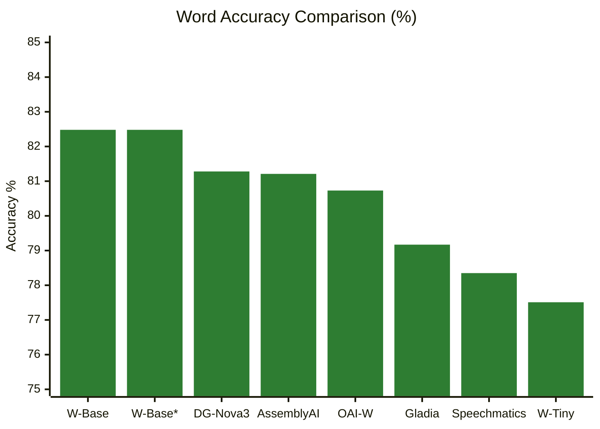
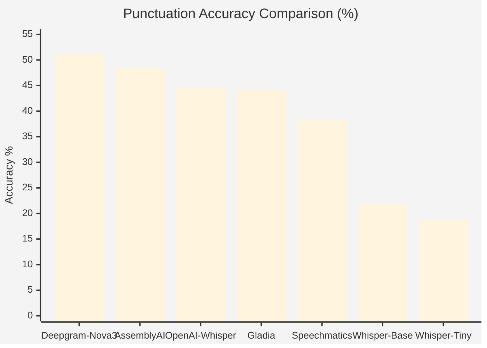
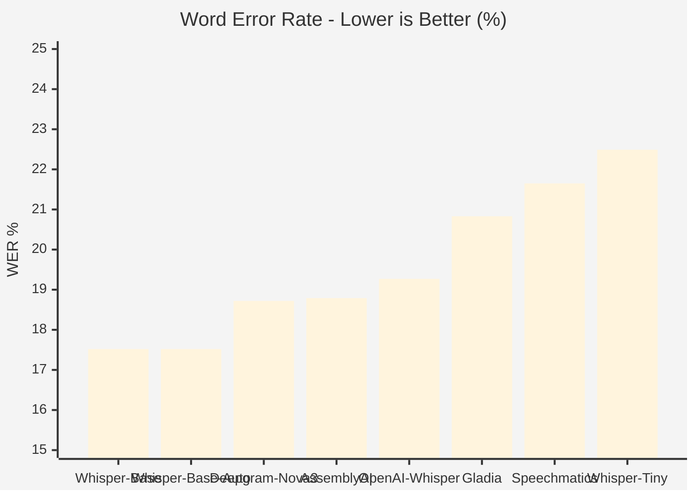
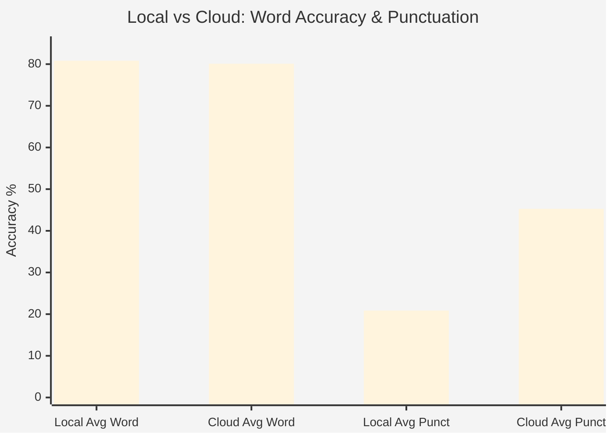

# Long-Form Audio STT Evaluation

Comparative evaluation of speech-to-text models on long-form audio transcription, measuring word accuracy and punctuation fidelity against professional reference transcripts.

## Test Methodology

**Audio Source:** 27-minute English podcast (4,748 words, 688 punctuation marks)
**Reference:** Professional human transcription
**Evaluation Metrics:** Word Error Rate (WER), Character Error Rate (CER), Punctuation Accuracy
**Models Evaluated:** 8 configurations (3 local, 5 cloud)

## Results Summary

### Word Accuracy Performance



*Legend: Green = Local models, Blue = Cloud models*
*W-Base = Whisper-Base, W-Base* = Whisper-Base Auto-detect, DG = Deepgram, OAI = OpenAI*

| Rank | Provider | Model | WER % | CER % | Word Accuracy % | Punctuation % |
|------|----------|-------|-------|-------|-----------------|---------------|
| 1 | Local | Whisper-Base | 17.52 | 5.38 | 82.48 | 21.90 |
| 2 | Local | Whisper-Base (auto-detect) | 17.52 | 5.38 | 82.48 | 21.90 |
| 3 | Deepgram | Nova-3 | 18.72 | 7.33 | 81.28 | 51.17 |
| 4 | AssemblyAI | Best | 18.79 | 6.24 | 81.21 | 48.43 |
| 5 | OpenAI | Whisper-1 | 19.27 | 6.40 | 80.73 | 44.44 |
| 6 | Gladia | Solaria-1 | 20.83 | 6.30 | 79.17 | 44.13 |
| 7 | Speechmatics | SLAM-1 | 21.65 | 7.15 | 78.35 | 38.23 |
| 8 | Local | Whisper-Tiny | 22.49 | 8.39 | 77.51 | 18.78 |

### Punctuation Accuracy Performance



| Rank | Provider | Model | Punctuation % | Context Match % | Punct Count | Word Accuracy % |
|------|----------|-------|---------------|-----------------|-------------|-----------------|
| 1 | Deepgram | Nova-3 | 51.17 | 32.33 | 698/688 | 81.28 |
| 2 | AssemblyAI | Best | 48.43 | 33.72 | 791/688 | 81.21 |
| 3 | OpenAI | Whisper-1 | 44.44 | 34.42 | 911/688 | 80.73 |
| 4 | Gladia | Solaria-1 | 44.13 | 22.56 | 651/688 | 79.17 |
| 5 | Speechmatics | SLAM-1 | 38.23 | 30.00 | 1003/688 | 78.35 |
| 6 | Local | Whisper-Base | 21.90 | 13.02 | 292/688 | 82.48 |
| 7 | Local | Whisper-Tiny | 18.78 | 8.60 | 288/688 | 77.51 |

## Analysis

### Word Error Rate (WER) Comparison



### Local vs Cloud Performance



**Word Accuracy:**
- Local Whisper-Base achieved the highest word accuracy (82.48%)
- Top cloud performer (Deepgram Nova-3) achieved 81.28%, 1.2 percentage points lower
- Performance gap between local and cloud models is minimal for word-level transcription

**Punctuation Accuracy:**
- Local models captured 42-43% of punctuation marks (288-292 out of 688)
- Cloud models captured 94-146% of reference punctuation count (651-1003 marks)
- Deepgram Nova-3 achieved near-perfect count (698 vs 688 reference)
- Local models demonstrate significantly reduced punctuation capabilities

### Error Distribution Analysis

**Local Whisper-Base (Highest Word Accuracy):**
- Hits: 3,960 (83.4%)
- Substitutions: 726 (15.3%)
- Deletions: 62 (1.3%)
- Insertions: 44 (0.9%)

**Deepgram Nova-3 (Best Cloud):**
- Hits: 3,919 (82.5%)
- Substitutions: 615 (13.0%)
- Deletions: 214 (4.5%)
- Insertions: 60 (1.3%)

### Punctuation Pattern Analysis

**Local Whisper Models:**
- Periods: 16% accuracy (42/263)
- Commas: 30% accuracy (31/104)
- Exclamation marks: 0% (0/19)
- Quotation marks: 0% (0/45)
- Colons: 0% (0/2)

**Deepgram Nova-3:**
- Near-perfect total count (698 vs 688)
- 32.33% context-aware placement accuracy
- Balanced punctuation distribution

**Over-punctuation Patterns:**
- Speechmatics: +46% (1,003 vs 688)
- OpenAI Whisper-1: +32% (911 vs 688)
- AssemblyAI Best: +15% (791 vs 688)

### Language Detection Impact

Whisper-Base with explicit language specification ("en") and auto-detection produced identical results (17.52% WER), indicating language detection does not impact accuracy for clear English audio.

### Model Size Impact

Local inference demonstrates 4.97 percentage point accuracy difference between whisper-base (82.48%) and whisper-tiny (77.51%), with minimal difference in punctuation capability (21.90% vs 18.78%).

## Observations

1. **Word-level vs Production Transcription:** Highest word accuracy does not correlate with production-ready output. Local Whisper-Base leads in word accuracy but ranks last in punctuation.

2. **Punctuation as Quality Indicator:** Cloud services demonstrate 2-3x higher punctuation accuracy compared to local models, representing a fundamental architectural difference in model capabilities.

3. **Deepgram Nova-3 Performance:** Achieves optimal balance with near-best word accuracy (81.28%) and highest punctuation accuracy (51.17%), producing transcripts closest to professional reference.

4. **Cost-Performance Tradeoffs:** Local inference provides superior word accuracy at zero marginal cost but requires extensive post-processing for punctuation. Cloud services provide complete transcription at per-use cost.

5. **Processing Speed:** Deepgram Nova-3 processed 27 minutes of audio in 3 seconds, demonstrating significant speed advantage over local inference.

## Use Case Recommendations

### Research/Analysis Applications
- **Model:** Local Whisper-Base
- **Rationale:** Highest word accuracy, zero marginal cost
- **Suitable for:** Search indexing, content analysis, data extraction
- **Limitation:** Unusable punctuation

### Publication-Ready Transcription
- **Model:** Deepgram Nova-3
- **Rationale:** Best punctuation (51.17%), near-best word accuracy (81.28%)
- **Suitable for:** Blog posts, articles, formal documentation
- **Characteristics:** Minimal post-processing required

### Budget-Constrained Production
- **Model:** Gladia Solaria-1
- **Rationale:** Balanced performance (79.17% word, 44.13% punctuation)
- **Characteristics:** Slight under-punctuation (5%) easier to correct than over-punctuation

### Maximum Cloud Accuracy
- **Model:** AssemblyAI Best
- **Rationale:** Highest cloud word accuracy (81.21%), strong punctuation (48.43%)
- **Characteristics:** Tends to over-punctuate by 15%

### Hybrid Approach
- **Method:** Local Whisper-Base + Cloud post-processing
- **Rationale:** Optimize for word accuracy, supplement with cloud punctuation
- **Cost profile:** Reduced per-minute costs while maintaining quality

## Technical Implementation

### Evaluation Scripts

**Word Accuracy Calculation:**
```bash
python scripts/calculate_benchmarks.py
```
Output: `data/inference/benchmark_results.json`

**Punctuation Accuracy Calculation:**
```bash
python scripts/calculate_punctuation_accuracy.py
```
Output: `data/inference/punctuation_results.json`

### Dependencies

```bash
# Create virtual environment
uv venv

# Install evaluation dependencies
uv pip install jiwer
```

### Metrics Methodology

**Word Error Rate (WER):** Calculated using jiwer library with standard Levenshtein distance
**Character Error Rate (CER):** Character-level edit distance normalized by reference length
**Punctuation Accuracy:** Context-aware matching of punctuation placement and frequency

## Data Structure

```
data/
├── audio/
│   └── podcast.mp3                    # Source audio (27 minutes)
├── ground-truth/
│   ├── truth_1.txt                    # Reference transcript
│   └── truth_1.srt                    # Reference with timestamps
└── inference/
    ├── runs/
    │   ├── local-stt/
    │   │   ├── run-1/                 # Whisper-Base (en)
    │   │   ├── run-2/                 # Whisper-Tiny
    │   │   └── run-3/                 # Whisper-Base (auto-detect)
    │   └── cloud-stt/
    │       ├── manual-1/              # Gladia Solaria-1
    │       ├── manual-2/              # Deepgram Nova-3
    │       ├── manual-3/              # AssemblyAI Best
    │       ├── manual-4/              # Speechmatics SLAM-1
    │       └── manual-5/              # OpenAI Whisper-1
    ├── runs-config.json               # Run metadata
    ├── benchmark_results.json         # WER/CER results
    └── punctuation_results.json       # Punctuation metrics
```

## Configuration

Run configurations are stored in `data/inference/runs-config.json` with the following schema:

```json
{
  "run_id": "string",
  "run_type": "local-stt|cloud-stt",
  "model": "string",
  "provider": "string",
  "inference_provider": "direct|edenai|null",
  "engine": "Buzz|api",
  "settings": {},
  "output_dir": "string",
  "completed": boolean
}
```

## Limitations

- Single audio file evaluation (n=1)
- English language only
- Podcast format (conversational speech)
- No speaker diarization evaluation
- No timestamp accuracy measurement
- Punctuation metric is heuristic-based, not ground-truth validated
